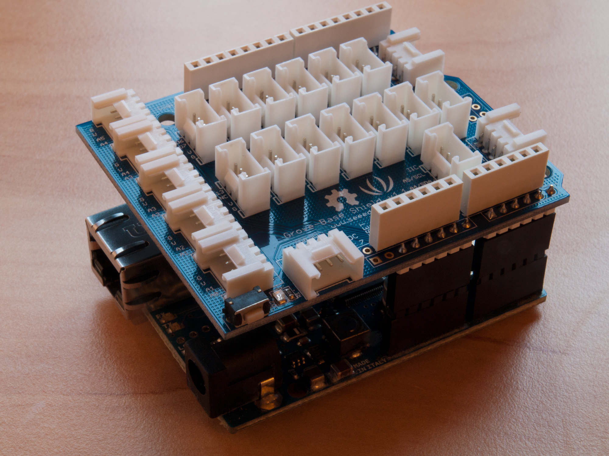

Insbesondere auf [Instructables](http://www.instructables.com/) stolperte ich in der Vergangenheit über die eine oder andere interessante Elektronik-Bastelei welche einen [Arduino](http://www.arduino.cc/) als Kern verwendete.

*Arduino* ist ein kleiner [Mikrocontroller](http://de.wikipedia.org/?search=Mikrocontroller) mit diversen Ein- und Ausgabemöglichkeiten für digitale und analoge Signale. Dabei wird das Stück Hardware komplett von einer Opensource Community entwickelt.
Unterdessen gibt es den Controller in den verschiedensten Ausführungen. Unter anderen ist sogar eine in Textilien vernähbare Edition erhältlich.

Ganz meiner Passion entsprechend brannte es mich schon länger unter den Fingernägeln, ein eigenes, Arduino-basiertes Projekt durchzuziehen.

### Ambilight
Bei meinem alten Philips Fernseher schätzte ich das eingebaute [Ambilight](http://de.wikipedia.org/?search=Ambilight) als nettes Feature. Dieses erhellte den Bereich *um* den Fernseher mit zum Bild passenden Farben.
Da diese Funktion für mich aber nie ein *Killerfeature* war, konnte ich beim Kauf eines neuen TV's getrost darauf verzichten.

Wieder einmal vom Arduino-Projektidee-Virus infiziert, sinnierte ich über mögliche Anwendungen und fand die Idee eines selbst gebauten Ambilights mehr als nur reizvoll.
Als ich nach einigen Recherchen im Netz dann auch noch die bereits funktionierende und sehr umfangreiche [Software von Michu](https://github.com/neophob/StripInvaders) samt [Projektdokumentation](http://pixelinvaders.ch/?page_id=396) entdeckte, gab es für mich kein Halten mehr.

Die Hauptfeatures der Software im Überblick:

* Ansteuerung von beliebig vielen *vollfarb* LED's
* Unterstützung mehrerer LED Controller
* Diverse Beleuchtungseffekte
* Steuerbar via [Open Sound Control](http://de.wikipedia.org/?search=Open%20Sound%20Control)-Kommandos (Clients für iOS und Android Geräte verfügbar)
* Komplett Open Source

### Komponenten
#### Elektronik
[Michu](http://www.neophob.com/) bietet zusammen mit [boxtec](http://www.boxtec.ch) ein komplettes [Basiskit](http://shop.boxtec.ch/product_info.php/products_id/40557) für die eigene LED-Leuchtshow an. Neben einem [Arduino Ethernet](http://arduino.cc/en/Main/ArduinoBoardEthernet) und Audiosensor sind alle nötigen Kabel enthalten.
Mit dabei ist ein [Grove Base Shield](http://www.seeedstudio.com/depot/grove-base-shield-p-754.html?cPath=132_134). Dieser lässt den einfachen Anschluss von externen Komponenten an den Controller zu. Praktisch, aber eigentlich optional.

#### Stromversorgung
Neben dem Kit steht zudem 5 Volt Netzteil und natürlich die eigentlichen LED-Leuchten auf der Einkaufsliste. Ersteres wird auf Zuschrift meinerseits bei [boxtec](http://www.boxtec.ch) in den nächsten Tagen erhältlich sein.

#### LED's
Die LED's sind in [der Schweiz](http://pixelinvaders.ch/?page_id=390) erhältlich, schienen mir persönlich jedoch arg teuer. Klar, die Entwicklung von *StripInvaders* brauchte Zeit und Herzblut. Als Teilzeitstudent wollte ich die Marge aber trotzdem nicht bezahlen. *(Viel lieber revanchiere ich mich nach erfolgreicher Inbetriebnahme mit dem einen oder anderen Bier per PayPal Spende :-) )*

Kurzum tat ich mich mit einigen Bürokollegen zusammen und machte eine Sammelbestellung direkt bei einem [Hersteller in China](http://rayconn.en.alibaba.com/product/453434275-200228857/Addressable_RGB_led_strip_WS2801.html). Für acht Meter LED-Streifen inkl. Versand bezahlten wir so knapp 170 US-Dollar.

### Experimentieren
Einen ersten Erfolgreichen Test konnte ich mit dem Mikrocontroller und 2 Metern LED's bereits durchführen, wie das getwitterte Video zeigt:

<blockquote class="twitter-tweet">
selfmade <a href="https://twitter.com/search?q=%23arduino&amp;src=hash">#arduino</a> ambilight is coming!&#10;thanks to the great software by <a href="https://twitter.com/neophob">@neophob</a> <a href="http://t.co/fAIEVfnA">http://t.co/fAIEVfnA</a>
&mdash; Manuel Alabor (@swissmanu) <a href="https://twitter.com/swissmanu/statuses/169113593529380865">February 13, 2012</a></blockquote>

Lernen konnte ich auch bereits etwas Neues: Die LED's sollten und können nicht über den *internen* 5 Volt Pin des Arduino gespiesen werden, auch nicht wenn dieser mit 12 Volt versorgt wird. Zum einen erhalten die Leuchten zuwenig Spannung, zum anderen würde auf dem Controller gemäss Michu zu viel Strom fliessen.

Nun warte ich auf die korrekten 5 Volt Netzteile und freue mich auf eine neue Runde Basteln.

Bis dahin gibt es unter [Projects](projects/) eine Zusammenfassung mit [allen wichtigen Informationen](project/arduino-ambilight). Sobald die letzten Teile eingetroffen sind und ich den Aufbau komplettieren konnte, gibt es natürlich noch einen finale Erfahrungsbericht inkl. Fotos & Videos.
