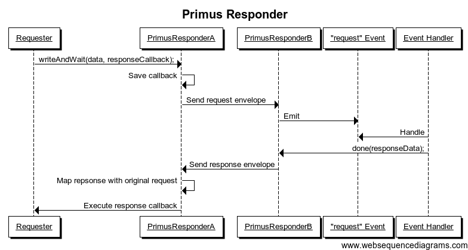

The nature of [websockets](https://developer.mozilla.org/de/docs/WebSockets) allows data transfer between two peers in "*realtime*". This mechanism is perfect for exchanging events without relation to each other. But what if you want to ask your peer for some specific response and wait until this particular response arrives?

<span class="more"></span>

### About the pattern
This pattern is well-known under the name [Request-Reply](http://www.enterpriseintegrationpatterns.com/RequestReply.html) or [Request-Response](http://en.wikipedia.org/wiki/Request-response) and builds the basis for todays HTTP communication on the web. Following JavaScript code shows how the Node.JS API implements this pattern to request some HTTP response from a webserver:

```javascript
var http = require('http')
	, options = {
		hostname: 'http://www.google.com'
		, port: 80
		, method: 'GET'
	};

http.request(options, function(response) {
	console.log('Connected');
	response.on('data', function(data) {
		console.log(data);
	});
});
```

As soon as a response is available, the callback function armed with the response object gets executed and the awaited data is processed.

### Add Request-Response Protocol Layer
Using websockets, you do not have this mechanism built-in since there is not really a *response* which has to follow on a *request*. More precisely, there is not even a thing called *request*: You exchange data with no relation to each other.

[Primus Responder](https://github.com/swissmanu/primus-responder) resolves this situation while being a plugin for the realtime communication wrapper [Primus](https://github.com/primus/primus). It allows to request the opposite peer for a response using a simple API known from other libraries.

```javascript
var Primus = require('primus')
	, PrimusResponder = require('primus-responder')
	, server = require('http').createServer()
	, options = { transformer: 'websockets' }
	, primus = new Primus(server, options);

primus.use('responder', PrimusResponder);

primus.on('connection', function(spark) {

	// Handle incoming requests:
	spark.on('request', function(data, done) {
		// Echo the received request data
		done(data);
	});

	// Request a response from the spark:
	spark.writeAndWait('request from server', function(response) {
		// Write the sparks response to console
		console.log('Reponse from spark:' response);
	});

});

server.listen(8080);
```

Demonstrated in the code example above, *Primus Responder* adds two things to *Primus*' core functionality: 

* A new event called `request` is emitted as soon as a peer requests a response.
* The new method named `writeAndWait(data, fn)` writes data to a peer and runs given callback function as the peer sends its response.

*Primus Responder* is available on the client too. Please see the [API documentation on Github](https://github.com/swissmanu/primus-responder#usage) for more detail.

### Inner Workings
#### Request Envelope
The request-response pattern is implemented using an additional protocal layer. When you call `writeAndWait(data, fn)`, *Primus Responder* wraps your data in an envelope containing some protocol meta information and sends it to the other peer:

```javascript
{
	plugin: "primus-responder"
	, requestId: "ss890f67-56a8-43e6-a490-948jkoe0ur0b"
	, data: "Please respond to me!"
};
```

Besides the actual data and a plugin identifier, a request envelope contains a generated [GUID](http://en.wikipedia.org/wiki/Globally_unique_identifier). This unique identifier is used to map a returned response message to its original request. On the receiver side, *Primus Responder* intercepts messages with a request envelope and emits a `request event. Registered event handlers then react on this event and send response data back to the requester.

#### Response Envelope
The response data is packaged into a response envelope containing the plugin name again, the response data and the original `requestId`. Notice that the former request identifier is called `responseId` now. That way, *Primus Responder* distinguishs between request and response envelopes.

```javascript
{
	plugin: "primus-responder"
	, responseId: "ss890f67-56a8-43e6-a490-948jkoe0ur0b"
	, data: "Hi there! Here's your response"
};
```

Receiving a response envelope, *Primus Responder* intercepts the message and uses the response identifier to map the response back to the original request. It then executes the response callback originally defined when `writeAndWait(data, fn)` was called.

#### Sequence Diagram
Find the following sequence diagram for a complete overview (click to enlarge). `PrimusResponderA` and `PrimusResponderB` reflect the two *Primus Responder* instances on client and server.

